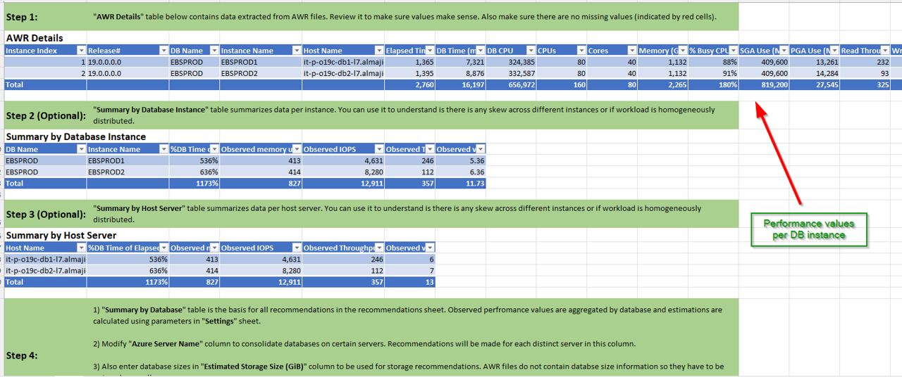
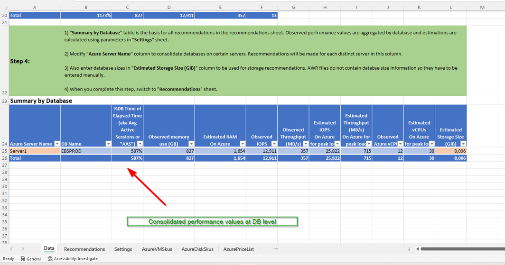
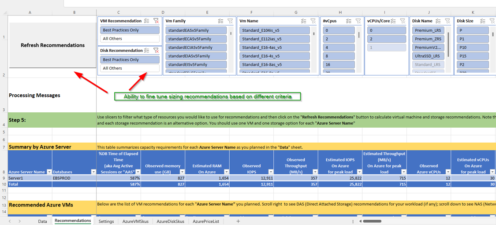
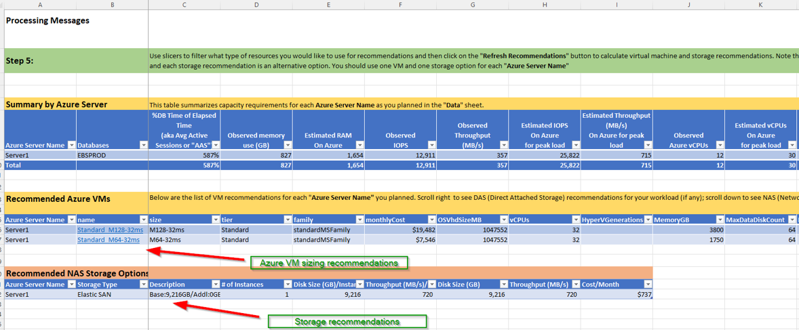
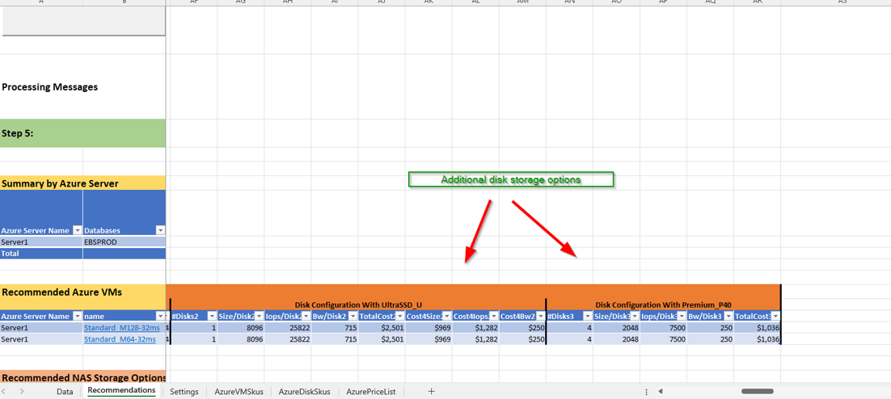

# Oracle Migration Assistant Tool (OMAT)

Oracle Migration Assistant Tool (OMAT) helps to understand resource usage on Oracle installations (on premise or in any cloud) and recommend the most suitable virtual machine that can run the same on Azure.

It works by processing Advanced Workload Repository (AWR) reports collected from the source system. Required data is extracted from AWR files and placed into an Excel workbook. For more information on different sections of workbook and the algorithm behind calculations see [AWR sizing document](/az-oracle-sizing/AWR%20Sizing%20Instructions.pdf).

OMAT essentially automates steps defined in the [AWR sizing document](/az-oracle-sizing/AWR%20Sizing%20Instructions.pdf) to speed up the process and to relieve user from complexities of interpreting the AWR report. Below are description of each step it executes and output

* AWR files are processed from a single directory,
* Data is extracted into an Excel file,
* Most suitable VM size(s)  for the Azure region given are selected and added to the Excel file,
* The resulting Excel file is ready to use for further analysis and fine tuning. For example, you can manually add another database by extracting data from its AWR file manually, change **calculation factors** (in the **Settings** worksheet) to see how your assumptions impact results or add/delete/modify recommended Azure VM sizes. See [AWR sizing document](/az-oracle-sizing/AWR%20Sizing%20Instructions.pdf) for more information on how to use the Excel file.

## Prerequisites and Limitations

Please review prerequisites and limitations of OMAT before using it for your scenario

* PowerShell 5.1 or above is required. PowerShell 5.1 comes preinstalled with Windows 10 and Windows 11. For more information refer to https://learn.microsoft.com/en-us/powershell/scripting/windows-powershell/install/installing-windows-powershell 
* Azure CLI 2.40 or or above is required. Setup script will automatically install the latest version or you can manually install Azure CLI from https://learn.microsoft.com/en-us/cli/azure/install-azure-cli-windows?tabs=azure-cli
* Excel 2019 or above is required
* PowerShell core is not supported (due to COM dependencies)
* AWR Reports  (created by running **awrrpt.sql**) or AWR Global (RAC) reports (created by running **awrgrpt.sql**) supported.

## How to install the tool

* Run PowerShell in Administrator mode.
* Copy and paste following command line into PowerShell window to set up the tool. This will create a folder **C:\OMAT** and download all required files into that folder. If you want to use a different folder, change the path in the command below. Setup script will also install Azure CLI if not already installed.

    ```powershell
    New-Item -ItemType Directory -Force -Path C:\OMAT | Out-Null;Set-Location C:\OMAT;Set-ExecutionPolicy -ExecutionPolicy Unrestricted -Scope CurrentUser;Invoke-WebRequest -Uri https://raw.githubusercontent.com/Azure/Oracle-Workloads-for-Azure/master/omat/setup.ps1 -OutFile .\setup.ps1;Unblock-File -Path .\setup.ps1;.\setup.ps1
    ```

## How to use the tool

* Copy all AWR files you collected in a folder: C:\AWR.
* Run `omat.ps1` as below

    ```powershell
    .\omat.ps1 -SourceFolder "C:\AWR" -AzureRegion westus
    ```

    Output should look like below

    ```powershell
    Connected to subscription 'mysubs' (XXXXXXXX-XXXX-XXXX-XXXX-XXXXXXXXXX) as 'myuser@mydomain.com'
    Using Azure region 'eastus'
    Processing files from directory : C:\AWR\
    Using template file             : C:\omat\template.xlsm
    1-Processing file : C:\AWR\AWR_REPORT1.html
    2-Processing file : C:\AWR\AWR_REPORT2.html
    3-Processing file : C:\AWR\AWR_REPORT3.html
    4-Processing file : C:\AWR\AWR_REPORT4.html
    5-Processing file : C:\AWR\AWR_REPORT5.html
    6-Processing file : C:\AWR\AWR_REPORT6.html
    Exporting to Excel...
    Exporting tables ...
    Fetching pricelist for eastus in USD. This operation takes a while.
    Populating AzurePriceList table...
    Fetching available Azure VM and Disk Skus in eastus. This operation takes a while.
    Populating AzureVMSkus table...
    Populating AzureDiskSkus table...
    Refreshing recommendations...
    Finished processing files from directory : C:\AWR\ in XXX seconds
    Open the Excel file "C:\AWR\AWR.xlsm" to review recommendations.
    Note that the file uses macros so ensure macros are enabled in Excel. See following link for step by step instructions: https://support.microsoft.com/en-us/office/enable-or-disable-macros-in-microsoft-365-files-12b036fd-d140-4e74-b45e-16fed1a7e5c6
    ```

* Open the output file **C:\AWR\AWR.xlsm**. More info on how to interpret this file can be found in [AWR sizing document](/az-oracle-sizing/AWR%20Sizing%20Instructions.pdf). Below are descriptions for each worksheet in the Excel file.

* **Data** page contains data for capacity planning and calculations. You can consider this page as the input data for recommendations. This page does not exist if the tool is run with `NoAwr` switch.
  * **AWR Details** table contains raw extracted information from your AWR reports
    
    Review and make sure AWR Details table does not have any missing values and existing values make sense. If there are missing values (the cells will indicate that with a red color), you may enter those values manually by talking to customer or using your best judgement.
  * **Summary by Database Instance** summarizes information in **AWR Details** by Instance
  * **Summary by Host Server** summarizes information in **AWR Details** by Host
  * **Summary by Database** summarizes information in **AWR Details** by Database. Results in the **Totals** section of this table is used to calculate required virtual machine sizes on Azure.
    Make sure to determine which server on Azure the database should be placed (first column). By default all databases are placed on a single server named **Server1** Also make sure to enter database sizes in this table (the last column).
    
* **Recommendations** page contains recommended Azure resources for your workload.
  * **Refresh Recommendations** button allows to re-calculate recommendations based on your choices.
  * Slicers at the top of the page allow you to limit recommendations to certain SKU classes. By default, tool applies best practices and recommends a minimal # of SKUs as alternatives.
    
  * **Summary by Azure Server** table aggregates metrics per database instance and calculates amount of resources required for each Azure VM.
  * **Recommended Azure VMs** table contains alternative Azure VM SKUs for your requirements. This table is refreshed every time you click **Refresh Recommendations** button.
    
  * **Recommended DAS Storage Options for this workload** table is extension to  **Recommended Azure VMs** table and contains alternative Direct Attached Storage (DAS) options using Azure MAnaged Disks per recommended Azure VM SKUs for your requirements. This table is refreshed every time you click **Refresh Recommendations** button and you have to scroll right to see table contents.  
    
  * **Recommended NAS Storage Options for this workload** table shows Network Attached Storage (NAS) options for the workload.
* **Settings** page allows you modify parameters to customize the way recommendations are calculated.
    
  * **Est'd Peak CPU factor** Observed vCPU requirements from the AWR reports will be multiplied by this factor to calculate amount of CPU required on Azure. For example, if observed CPU usage requires 10 vCPUs and this factor is 2, required CPU on Azure will be calculated as 20 vCPUs.
  * **Est'd Peak RAM factor** Observed memory requirements from the AWR reports will be multiplied by this factor to calculate amount of memory required on Azure. For example, if observed memory usage is 10GB and this factor is 2, required memory on Azure will be calculated as 20GB.
  * **Est'd Peak I/O factor** Observed I/O requirements (both throughput and IOPS) from the AWR reports will be multiplied by this factor to calculate amount of I/O throughput and IOPS required on Azure. For example, if observed I/O throughput usage is 500MB/sec and this factor is 2, required I/O throughput on Azure will be calculated as 1000MB/sec.
  * **vCPU HT multiplier** Hyper-threading level on Azure. This should be 2 for the most part.
  * **%Busy CPU-thrashing threshold** If observed vCPU usage from AWR reports is above this treshold then required amount of vCPU on Azure is also multiplied by **%Busy CPU-thrashing factor**. For example, if observed CPU usage requires 10 vCPUs and **Est'd Peak CPU factor** factor is 2 and observed **% Busy CPU value** is above **%Busy CPU-thrashing threshold** and **%Busy CPU-thrashing factor** is 1.5, required CPU on Azure will be calculated as 10x2x1.5=30 vCPUs. This is to account for CPU thrashing.
  * **%Busy CPU-thrashing factor** See previous item.
  * **NetApp_MinIOPSForRecommendation** Min IOPS requirement to start considering ANF recommendations. ANF recommendations will not be created for IOPS requirements below this value.
  * **NetApp_MinThroughputMBsForRecommendation** Min IO throughput requirement to start considering ANF recommendations. ANF recommendations will not be created for IO throughput below this value.
  * **RecommendVMCPUsLowerLimitPercent** Virtual machines which has CPUs greater than this portion of vCPU requirement will be considered for recommendations. For example, if this value is 70% and vCPU requirement of workload is 100 vCPUs, VMs starting from 70 vCPUs will be recommended.
  * **RecommendVMCPUsUpperLimitPercent** Virtual machines which has CPUs less than this portion of vCPU requirement will be considered for recommendations. For example, if this value is 150% and vCPU requirement of workload is 100 vCPUs, VMs with up to 150 vCPUs will be recommended. 0 (zero) means the upper limit will be determined by next available vCPU count as described below. 
  If there are no VMs between the actual vCPU requirement and this value, then the minimum vCPUs larger than requirement will be recommended. For example, if vCPU requirement is 125 vCPUs and this value is 130% then upper limit for recommendation is 125*1.3=163. However, there are no VMs between 125-163 vCPUs. In that case the min available vCPU count larger than requirement (which is 192 vCPUs) will be used.
  * **RecommendVMMemoryLowerLimitPercent** Virtual machines which has memory greater than this portion of memory requirement will be considered for recommendations. For example, if this value is 70% and memory requirement of workload is 1TB, VMs starting from 700GB memory will be recommended.
* **AzureVMSkus** page contains all VM SKUs that can be used from this subscription in the selected Azure region.
* **AzureDiskSkus** page contains all disk and storage SKUs that can be used from this subscription in the selected Azure region.
* **AzurePriceList** page contains the list of prices of all SKUs in the selected Azure region.

## Command Line

Usage:

```powershell
omat.ps1 [OPTIONS]
```

Options:

```powershell
-h, Help          : Display this screen.
-SourceFolder     : Source folder that contains AWR reports in HTML format. Default is '.' (current directory).
-NoAwr            : Creates an empty file so that you can manually enter vCPU, memory and disk requirements and generate recommendations.
-OutputFile       : Full path of the Excel file that will be created as output. Default is same name as SourceFolder directory name with XLSM extension under SourceFolder directory.
-TemplateFileName : Excel template that will be used for capacity estimations. Default is '.\template.xlsm'.
-AzureRegion      : Name of the Azure region to be used when generating Azure resource recommendations. Default is 'westus'.
-Debug            : Generates debug output.
```

Sample:

```powershell
omat.ps1 -SourceFolder "C:\AWR" -AzureRegion westus
```
